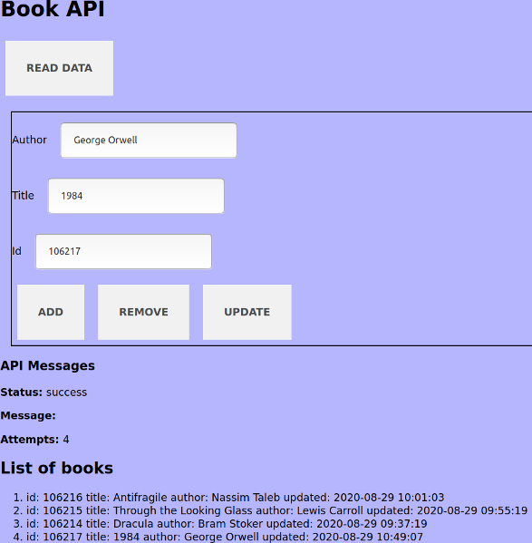

# Book Database Web App

Book Database API web app.

Client CRUD web app for the [Forverkliga Database API](https://www.forverkliga.se/JavaScript/api/crud.php). It simulates a poorly designed Book Database API with CRUD-functionality.

## Screenshot

## Summary of API

1. The API has a high likelihood of failing. On every operation.
2. The API returns `HTTP 200` on every operation
3. The API returns a JSON but the MIME-type is erroneously set to `text/html`.
4. The API accepts only query-parameters.
5. Only `GET` is used.

## Specs
* The app can request a API-key
* All AJAX-calls are repeated until they succeed (with a limit of 10 tries).
* CRUD functionality:
  * Add data to database
  * View data in database
  * Modify data in database
  * Delete data

## Get Started
Disable CORS in your browser (CORS everywhere extension) or launch a simple Python webserver in the app's root folder:

~~~sh
$ python -m SimpleHTTPServer 8080
~~~

# Requirements
ES6
